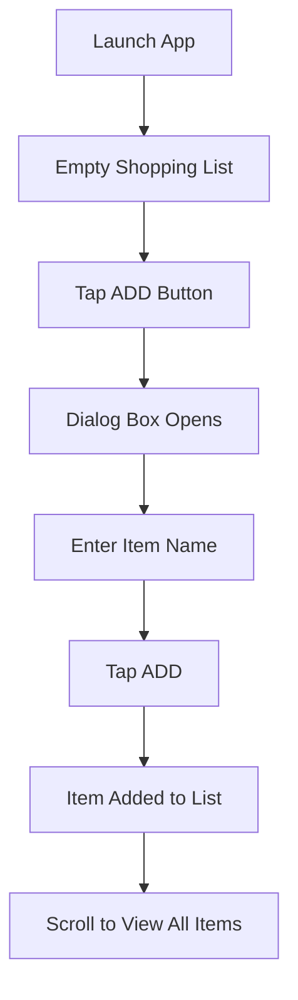

# Listify :shopping_cart:

[](https://flutter.dev/)  
[](https://dart.dev/)

A **Flutter-based mobile application** designed to help you manage your shopping items efficiently. With an intuitive and responsive interface, Listify makes it simple to add, view, and organize your shopping list. This project highlights key Flutter concepts such as user input handling, state management, and building UI with Material Design components.

> **Perfect for:**  
> - Beginner developers exploring Flutter & Dart  
> - Users seeking a lightweight tool for managing shopping needs

---

## 📋 Features

### 1. **Add Items**
- :sparkles: **Interactive Input:**  
  Use a pop-up dialog box with a text field to add new items.
- :arrow_right: **Instant Update:**  
  Items appear immediately in the shopping list.

### 2. **View Shopping List**
- :eye: **Clean List Display:**  
  View all items in a neat, scrollable format.
- :floppy_disk: **In-memory Storage:**  
  Items persist during the session.

### 3. **Responsive & Intuitive UI**
- :art: **Material Design:**  
  Built with Flutter’s Material Design to ensure a visually consistent and appealing interface.
- :iphone: **Device-Friendly:**  
  Fully responsive design for optimal viewing on any device.

### 4. **Dynamic State Management**
- :arrows_counterclockwise: **Real-Time Updates:**  
  Utilizes Flutter’s `setState` for smooth, dynamic UI updates.

---

## 🔍 How It Works



1. **Launch the App:**  
   Start with an empty shopping list screen.
2. **Add Items:**  
   Tap the **"Add"** button to open a dialog. Enter the item name and confirm with **"ADD"**.
3. **View Your List:**  
   Watch as your items update instantly in a scrollable list.
4. **Session Storage:**  
   Items are kept in memory for the duration of your session.

---

## 🛠 Technologies Used

- **Framework:** Flutter  
- **Language:** Dart

**Key UI Components:**
- **MaterialApp:** Overall layout management  
- **StatelessWidget & StatefulWidget:** UI and logic separation  
- **ListView:** Dynamic list rendering  
- **AlertDialog:** User input prompt  
- **TextEditingController:** Text field management

---

## 🚀 Installation Guide

### Prerequisites
- [Flutter SDK](https://flutter.dev/docs/get-started/install) installed.
- An IDE such as [Android Studio](https://developer.android.com/studio) or [VS Code](https://code.visualstudio.com/) with Flutter and Dart plugins.

### Steps to Install and Run the App

1. **Clone the Repository:**
   ```bash
   git clone <repository-url>
   cd <project-folder>
   ```

2. **Install Dependencies:**
   ```bash
   flutter pub get
   ```

3. **Run the App:**
   ```bash
   flutter run
   ```
   - Use an emulator or a connected physical device.

---

## 📁 Project Structure

```plaintext
/lib
  ├── main.dart          // App entry point
  ├── App.dart           // MaterialApp configuration
  ├── TodoList.dart      // StatefulWidget for shopping list management
  ├── components/        // Additional UI components
```

---

## 🎓 Learnings and Insights

- **State Management:**  
  Mastered dynamic UI updates using Flutter’s `setState`.
  
- **Dialog Handling:**  
  Managed user input with `AlertDialog` and `TextEditingController`.

- **List Rendering:**  
  Implemented scrollable lists using `ListView` for dynamic content.

- **Material Design:**  
  Applied Material Design principles for a consistent and modern UI.

- **Flutter Basics:**  
  Explored the use of both `StatelessWidget` and `StatefulWidget` to build a complete application.

---

## 🔮 Future Improvements

- **Persistent Storage:**  
  Integrate local storage (e.g., `SharedPreferences` or SQLite) to save the list across sessions.
  
- **Item Deletion:**  
  Add functionality to remove items from the list.

- **Item Categorization:**  
  Enable grouping items (e.g., groceries, electronics).

- **Search & Sorting:**  
  Introduce a search bar and sorting options for better organization.

- **Cross-Platform Optimization:**  
  Enhance performance for iOS and web platforms.

---

## 💡 Usage Scenarios

Ideal for:
- **Shopping Management:**  
  Keeping track of groceries, electronics, or any essentials.
- **Learning Flutter:**  
  A practical project for mastering Flutter's core concepts.
- **Educational Demo:**  
  Demonstrating simple yet effective app architecture.

---

## 🎬 Demo

<p align="center">
  
  
  <br><br>
  
  
</p>

---

## 📜 License

This project is licensed under the MIT License. See the `LICENSE` file for details.

---

## 🙏 Acknowledgments

- Flutter and Dart documentation for comprehensive guides.
- Open-source tools and libraries that made development smoother.
- The developer community for invaluable insights and support.

---

This revised README should now provide a more engaging, visual, and organized presentation of your project, making it appealing and easier to understand at a glance.
