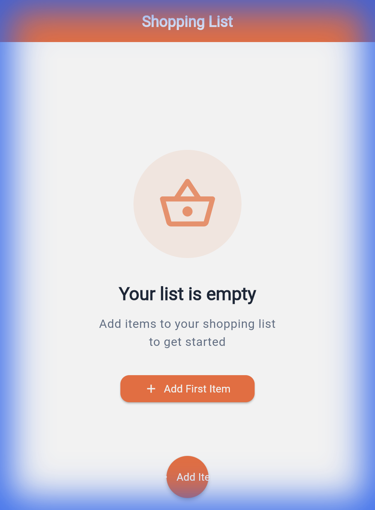
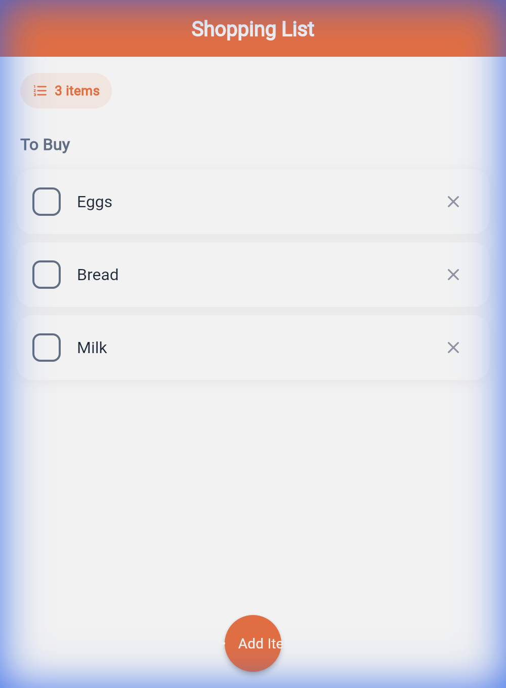
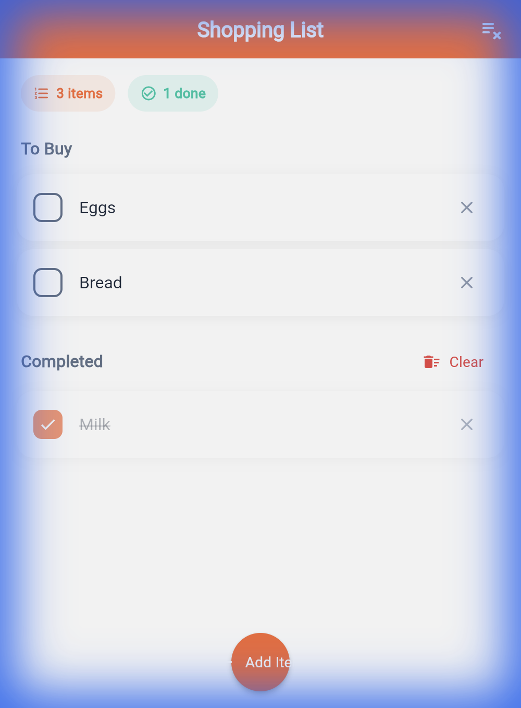

<div align="center">

# 🛒 Listify

### A Modern Shopping List App Built with Clean Architecture

<p>
  
  
  
  
</p>

<p>
  
  
  
</p>

---

**🎯 Interview-Ready • 🏗️ Clean Architecture • 🧪 Fully Tested • 🚀 Production Quality**

</div>

---

## 📸 Screenshots

<table>
  <tr>
    <td align="center">
      
      <br/>
      <b>Empty State</b>
      <br/>
      <sub>Clean onboarding experience</sub>
    </td>
    <td align="center">
      
      <br/>
      <b>Shopping List</b>
      <br/>
      <sub>Organized "To Buy" section</sub>
    </td>
    <td align="center">
      
      <br/>
      <b>Completed Items</b>
      <br/>
      <sub>Active & completed sections</sub>
    </td>
  </tr>
</table>

---

## 🎬 Live Demo

<div align="center">
  
  <br/>
  <sub>Full interaction flow: Add → Complete → Organize</sub>
</div>

---

## ✨ Features

| Feature | Description |
|:-------:|-------------|
| ➕ | **Quick Add** - Add items with a single tap |
| ✅ | **Mark Complete** - Check off purchased items |
| 👆 | **Swipe to Delete** - Remove items with gesture |
| ↩️ | **Undo Support** - Restore accidentally deleted items |
| 💾 | **Persistent Storage** - Data saved locally with Hive |
| 🌓 | **Dark Mode** - Automatic system theme detection |
| 📱 | **Responsive** - Works on mobile, tablet, and web |

---

## 🏗️ Architecture

This project follows **Clean Architecture** with clear layer separation:

```
┌─────────────────────────────────────────────────────────┐
│                    📱 PRESENTATION                       │
│  ┌─────────────┐  ┌─────────────┐  ┌─────────────┐     │
│  │   Widgets   │  │    Pages    │  │    BLoC     │     │
│  └─────────────┘  └─────────────┘  └─────────────┘     │
├─────────────────────────────────────────────────────────┤
│                     📐 DOMAIN                            │
│  ┌─────────────┐  ┌─────────────────────────────┐      │
│  │  Entities   │  │  Repository Interfaces      │      │
│  └─────────────┘  └─────────────────────────────┘      │
├─────────────────────────────────────────────────────────┤
│                      💾 DATA                             │
│  ┌─────────────┐  ┌─────────────┐  ┌─────────────┐     │
│  │   Models    │  │ DataSources │  │ Repository  │     │
│  └─────────────┘  └─────────────┘  └─────────────┘     │
└─────────────────────────────────────────────────────────┘
```

### Project Structure

```
lib/
├── core/
│   └── theme/                 # 🎨 Material 3 theming
├── features/
│   └── shopping_list/
│       ├── data/              # 💾 Hive, models, repository impl
│       ├── domain/            # 📐 Entities, interfaces
│       └── presentation/      # 📱 BLoC, pages, widgets
├── app.dart                   # App configuration
├── injection.dart             # 💉 GetIt dependency injection
└── main.dart                  # Entry point
```

---

## 🛠️ Tech Stack

<table>
  <tr>
    <td align="center"><b>Category</b></td>
    <td align="center"><b>Technology</b></td>
    <td align="center"><b>Why?</b></td>
  </tr>
  <tr>
    <td>🎯 Framework</td>
    <td>Flutter 3.16+</td>
    <td>Cross-platform, single codebase</td>
  </tr>
  <tr>
    <td>📊 State</td>
    <td>flutter_bloc</td>
    <td>Predictable, testable state management</td>
  </tr>
  <tr>
    <td>💾 Storage</td>
    <td>Hive</td>
    <td>Fast, lightweight NoSQL database</td>
  </tr>
  <tr>
    <td>💉 DI</td>
    <td>GetIt</td>
    <td>Simple service locator pattern</td>
  </tr>
  <tr>
    <td>⚠️ Errors</td>
    <td>dartz (Either)</td>
    <td>Functional error handling</td>
  </tr>
  <tr>
    <td>🧪 Testing</td>
    <td>bloc_test, mocktail</td>
    <td>Comprehensive test coverage</td>
  </tr>
</table>

---

## 🚀 Quick Start

```bash
# Clone the repo
git clone https://github.com/yxshee/listify.git
cd listify

# Install dependencies
flutter pub get

# Generate Hive adapters
dart run build_runner build --delete-conflicting-outputs

# Run the app
flutter run
```

---

## 🧪 Testing

```bash
# Run all tests
flutter test

# Run with coverage
flutter test --coverage

# Run specific test file
flutter test test/features/shopping_list/bloc/shopping_list_bloc_test.dart
```

| Test Type | Count | Status |
|-----------|-------|--------|
| Unit Tests (BLoC) | 12 | ✅ Passing |
| Widget Tests | 5 | ✅ Passing |
| **Total** | **17** | **✅ All Passing** |

---

## 📋 Interview Talking Points

<details>
<summary><b>🏗️ Architecture & Patterns</b></summary>

- **Clean Architecture**: Separation of UI, business logic, and data
- **Repository Pattern**: Abstracts data sources for testability
- **Dependency Injection**: GetIt for loose coupling
- **BLoC Pattern**: Reactive, predictable state management

</details>

<details>
<summary><b>🧪 Testing Strategy</b></summary>

- **Unit Tests**: BLoC logic tested with `bloc_test`
- **Widget Tests**: UI components with `flutter_test`
- **Mocking**: Using `mocktail` for clean mocks

</details>

<details>
<summary><b>⚠️ Error Handling</b></summary>

- **Either Type**: Functional approach from `dartz`
- **Typed Failures**: Custom failure classes for specific errors
- **User Feedback**: SnackBars for error display

</details>

> 📖 See [docs/INTERVIEW_GUIDE.md](docs/INTERVIEW_GUIDE.md) for detailed Q&A

---

## 🔄 CI/CD

GitHub Actions pipeline with:

- ✅ Code analysis (`flutter analyze`)
- ✅ Test execution with coverage
- ✅ Android APK build
- ✅ iOS build (no codesign)
- ✅ Web build

---

## 📂 Key Files

| File | Purpose |
|------|---------|
| [`lib/injection.dart`](lib/injection.dart) | Dependency injection setup |
| [`lib/features/.../bloc/`](lib/features/shopping_list/presentation/bloc/) | BLoC state management |
| [`lib/features/.../domain/`](lib/features/shopping_list/domain/) | Business entities & interfaces |
| [`.github/workflows/ci.yml`](.github/workflows/ci.yml) | CI/CD pipeline |
| [`docs/INTERVIEW_GUIDE.md`](docs/INTERVIEW_GUIDE.md) | Interview preparation |

---

## 📜 License

This project is licensed under the MIT License - see [LICENSE](LICENSE) for details.

---

<div align="center">

**Built with ❤️ using Flutter**

[](https://github.com/yxshee)

</div>
